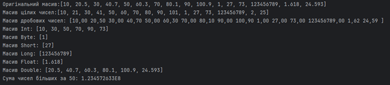
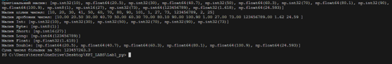

# Java labs(Python as secondary languge)

## Structure
*labX_py* - java code for labX

*labX_py* - python code for labX

*reports* - reports for all labs

*images* - screenshots of results for all labs

## Results
### Lab1
Java

Python

